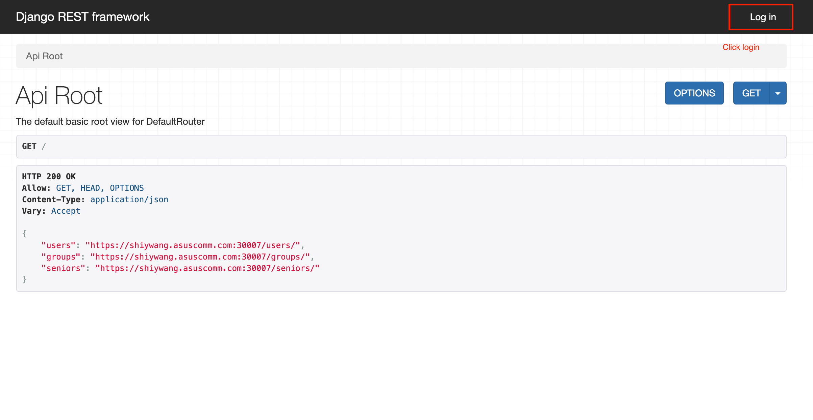
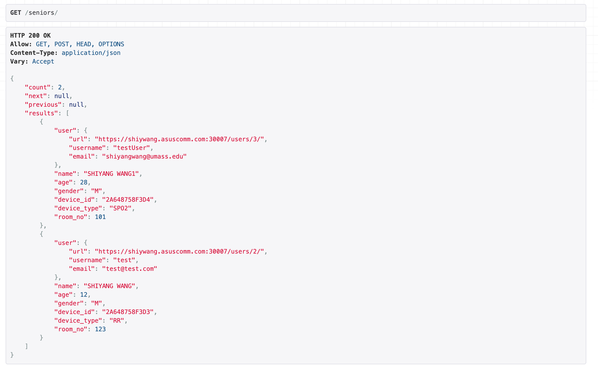

# How to deploy on top of Kubernetes

Make sure you have kubernetes cluster pre-intalled


### Build docker image and push to registry

build api && push to docker registry
```
cd Server/api 
docker build -t nelab/neapi  .
docker push nelab/neapi
```

build web && push to docker registry
```
cd Server/web
docker build -t nelab/neweb .
docker push nelab/neweb
```

build nodeserver (middle man) && push to docker registry
```
cd Server/nodeserver
docker build -t nelab/nenode .
docker push nelab/nenode
```

build PostgreSQL db && push to docker registry
```
cd Server/db
docker build -t nelab/nedb .
docker push nelab/nedb
```

### Deploy micro service

First deploy PostgreSQL statefulsets and service

```
kubectl apply -f Server/deploy/kubernetes/postgresql.yaml
kubectl apply -f Server/deploy/kubernetes/postgresql-service.yaml
```

Once PostgreSQL statefulsets are good, then deploy api and node and web
```
kubectl apply -f Server/deploy/kubernetes/
```

## How to add seniors and devices

First login Django backend https://shiywang.asuscomm.com:30007/ click top right login button



Then login input user/password, current default test password is admin/uched4123


Then jump to link seniors to add senior and device ID so that mezoo device can connect in.


Fill in all the information including username/email/name/age/gender Device ID like `2A648758F3D3`


Check the resut after POST succeed.




## How to run stimulation tests

after succesfully configed all the services.

```
cd Test/Server_Test/

rm data_store/datastore.txt

python3 test1.py 5
```
