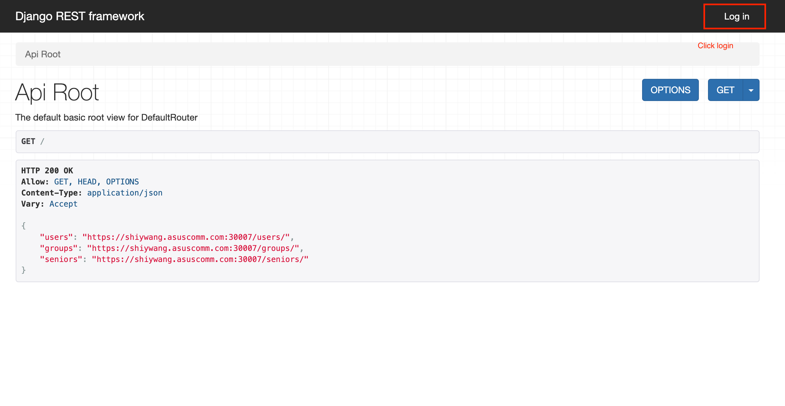
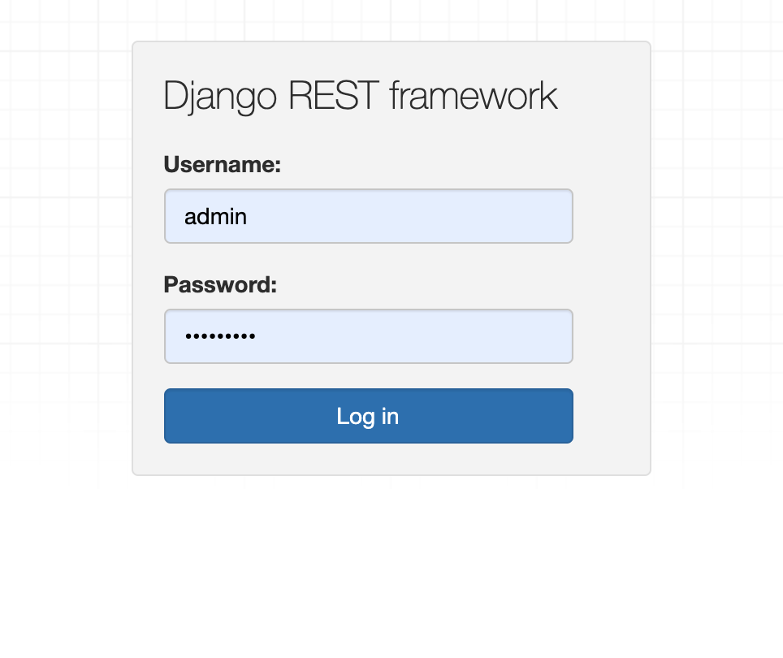
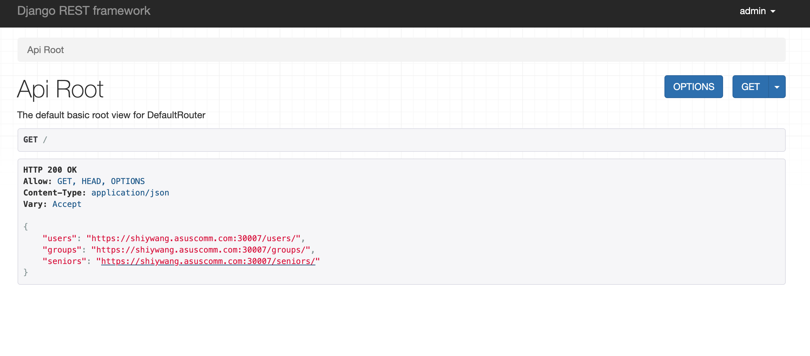
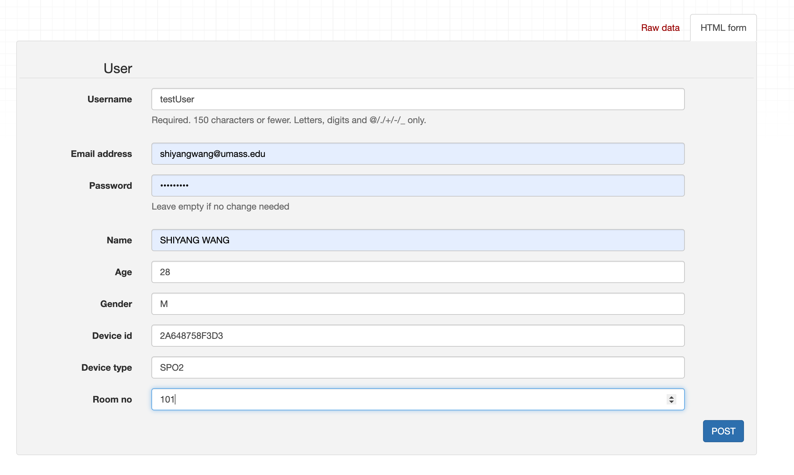
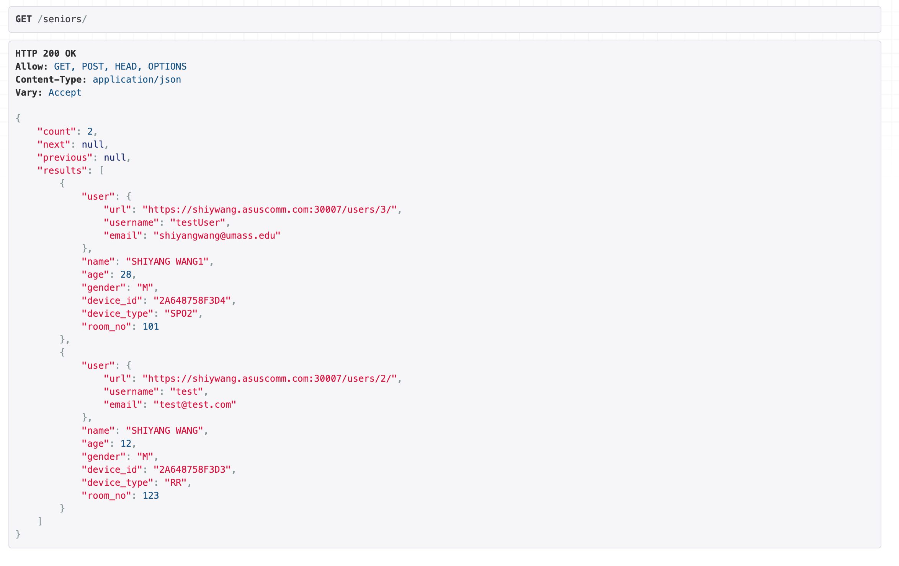

# How to add seniors and devices

First login Django backend https://shiywang.asuscomm.com:30007/ click top right login button

Then login input user/password, current default test password is admin/uched4123

Then jump to link seniors to add senior and device ID so that mezoo device can connect in.

Fill in all the information including username/email/name/age/gender Device ID like `2A648758F3D3`

Check the resut after POST succeed.

